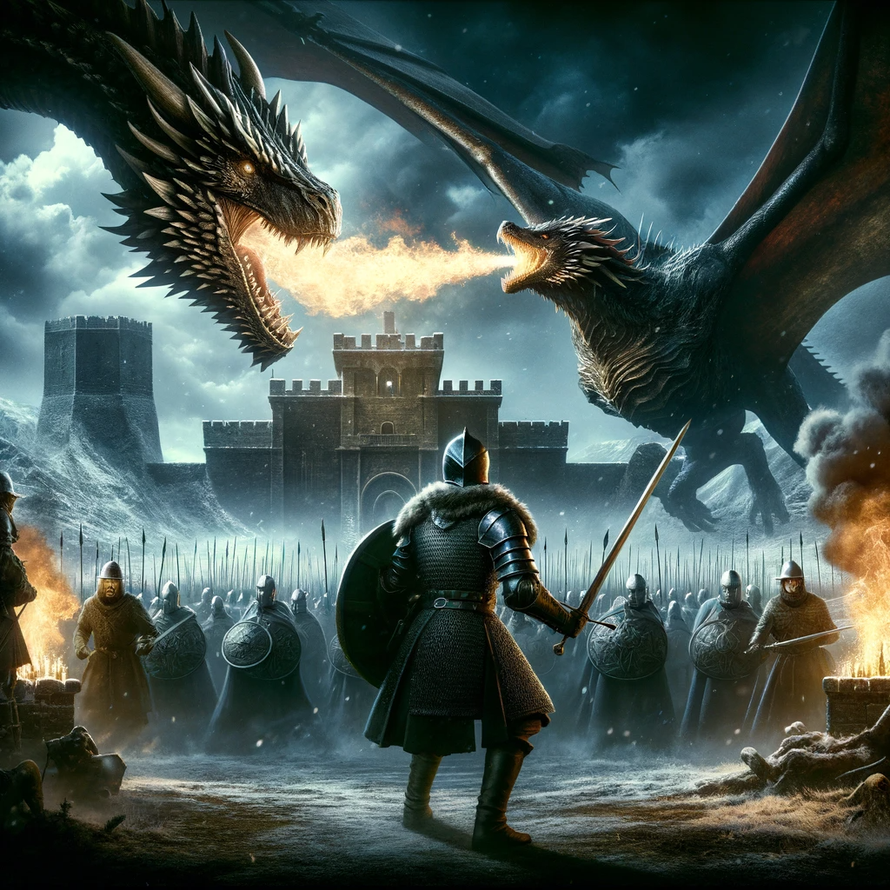
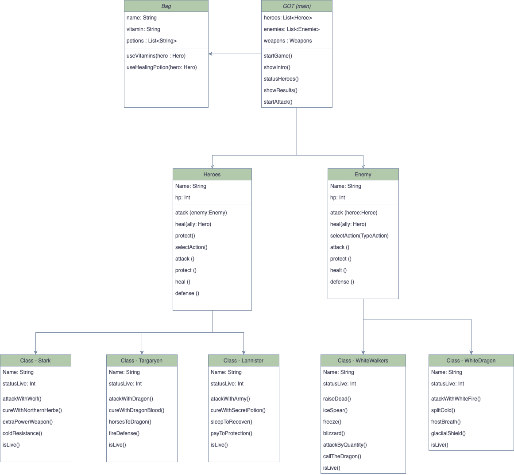

<title>README - Game of Thrones Kotlin Adventure</title>

<h1 align="center">Game of Thrones Kotlin Adventure</h1>

<strong>Description:</strong> Game of Thrones Kotlin Adventure is an interactive text-based game where players embark on a journey in the world of Westeros. Players choose characters from notable Houses, battle against White Walkers and dragons, and make strategic decisions to survive and conquer.

<h2 align="center">Game Logic and Structure</h2>

The game is built on a complex and interactive class structure, ensuring a dynamic and engaging gameplay experience. Below is an overview of the main classes and their interactions:

<ul>
  <li><strong>Heroes:</strong> This class represents the playable characters in the game, each with unique abilities and health points.</li>
  <li><strong>Enemies:</strong> This class includes the White Walkers and the White Dragon, the primary antagonists in the game.</li>
  <li><strong>Bag:</strong> A shared resource for heroes, containing potions and vitamins to aid them in their quest.</li>
  <li><strong>Game Mechanics:</strong> The game progresses through rounds, with each hero taking turns to make strategic decisions.</li>
</ul>

The following diagram illustrates the relationship between the different classes:

Each class is designed to offer a unique contribution to the gameplay, ensuring a rich and varied gaming experience.

<h2 align="center">How to Play</h2>
<ol>
    <li><strong>Starting the Game:</strong> Run the game in a Kotlin-supported environment. The main menu will guide you through the character selection and game setup.</li>
    <li><strong>Character Selection:</strong> Choose your character from famous Houses like Stark, Lannister, or Targaryen. Each house has unique abilities and strengths.</li>
    <li><strong>Battling Enemies:</strong> Engage in battles with White Walkers and dragons. Use strategic moves, potions, and special powers to defeat them.</li>
    <li><strong>Winning the Game:</strong> Survive the onslaught of enemies and make wise decisions to emerge victorious.</li>
</ol>

<h2 align="center">Game Rules</h2>
<ul>
    <li>Each character has a specific amount of health points (HP).</li>
    <li>Using potions or vitamins from the Bag will skip your turn.</li>
    <li>Enemies randomly attack after each round.</li>
    <li>The game ends when all enemies are defeated or all heroes are dead.</li>
</ul>

<h2 align="center">System Requirements</h2>

Since it's a text-based game, it requires minimal system resources. A Kotlin-supported environment or IDE is sufficient to run the game.

<h2 align="center">Contact</h2>

For support and feedback, please contact me <a href="https://github.com/Pablo-Mdz"> here</a>.

